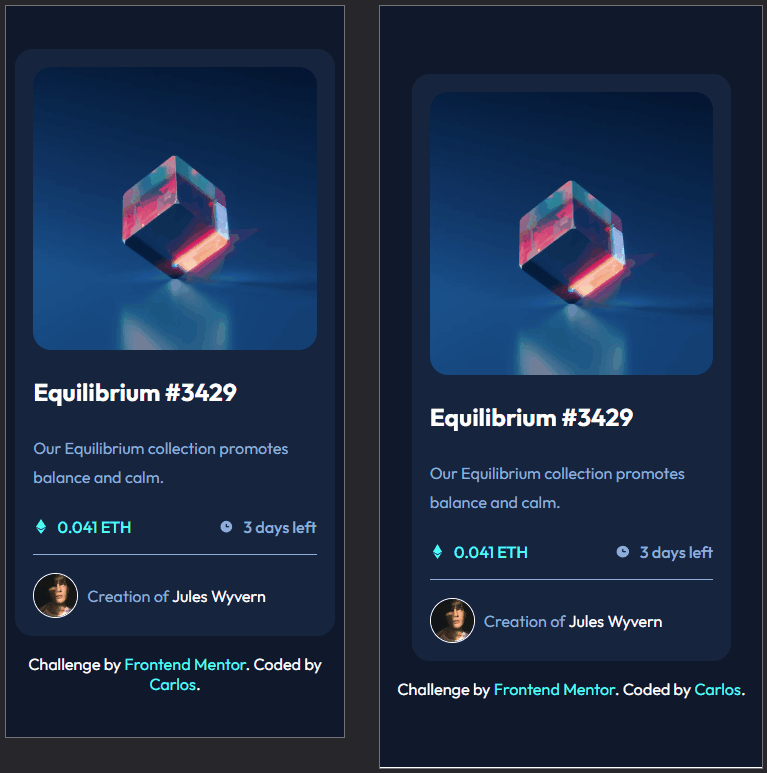
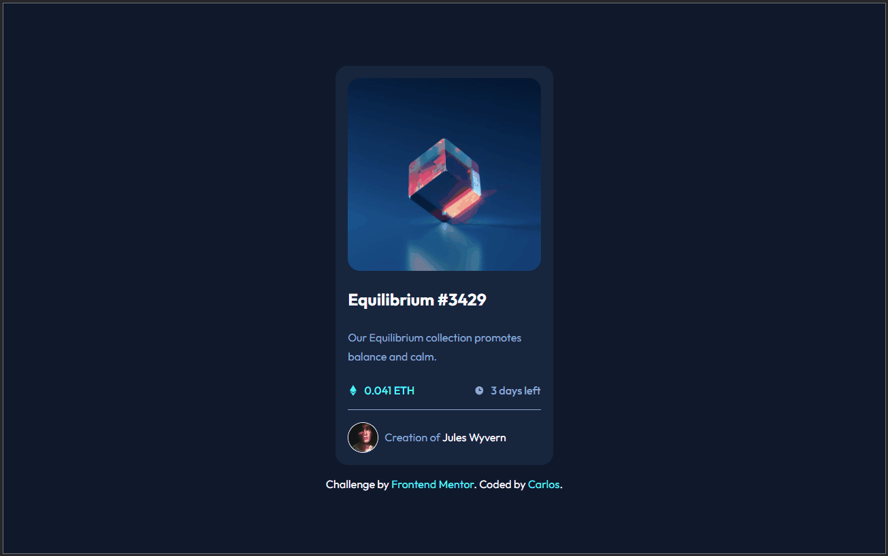

# Frontend Mentor - NFT preview card component no Frontend Mentor

Esta é a minha solução para o desafio <a href="https://www.frontendmentor.io/challenges/nft-preview-card-component-SbdUL_w0U" target="_blank" rel="noopener noreferrer">**NFT preview card component no Frontend Mentor**</a>. Os desafios do **Frontend Mentor** ajudam a melhorar suas habilidades de codificação ao construir projetos práticos e realistas.

## 📋 Tabela de Conteúdos

- [🔍 Visão Geral](#-visão-geral)
  - [🎯 O Desafio](#-o-desafio)
  - [📸 Screenshot](#-screenshot)
  - [🔗 Links](#-links)
- [⚙️ Meu Processo](#️-meu-processo)
  - [🛠️ Tecnologias Utilizadas](#️-tecnologias-utilizadas)
  - [📚 O que Aprendi](#-o-que-aprendi)
  - [🔄 Desenvolvimento Contínuo](#-desenvolvimento-contínuo)
- [👨‍💻 Autor](#-autor)
- [📝 Licença](#-licença)
- [🙌 Agradecimentos](#-agradecimentos)

## 🔍 Visão Geral

### 🎯 O Desafio

Os usuários devem ser capazes de:

- Visualizar o layout otimizado de acordo com o tamanho da tela do dispositivo
- Ver os efeitos de hover nos elementos interativos

### 📸 Screenshot

| 📱 Versão Mobile | 💻 Versão Desktop |
|------------------|-------------------|
|  |  |

### 🔗 Links

- 🔧 GitHub - <a href="https://github.com/slayer-br/nft-preview-card" target="_blank" rel="noopener noreferrer">NFT Preview Card Component</a>
- 🌐 Site ao vivo: <a href="https://slayer-br.github.io/nft-preview-card/" target="_blank" rel="noopener noreferrer">NFT Preview Card Component</a>

---

## ⚙️ Meu Processo

### 🛠️ Tecnologias Utilizadas

- **HTML5** semântico
- **CSS3** com variáveis customizadas
- **Flexbox**
- **Responsividade mobile-first**
- **Google Fonts**: "Outfit"

### 📚 O que Aprendi

Este desafio me permitiu aplicar conceitos importantes como:

- Organização semântica do HTML
- Uso de Flexbox para distribuir conteúdo horizontal e verticalmente
- Criação de layouts mobile-first e responsivos
- Aplicação de estilos reutilizáveis com variáveis CSS

### 🔄 Desenvolvimento Contínuo

Pretendo continuar explorando melhorias como:

- Acessibilidade (uso de `aria-label`, foco visual, contraste)
- Animações CSS suaves para hover
- Componentização e escalabilidade com frameworks modernos

---

## 👨‍💻 Autor

- GitHub - <a href="https://github.com/slayer-br" target="_blank" rel="noopener noreferrer">@slayer-br</a>
- Frontend Mentor - <a href="https://www.frontendmentor.io/profile/slayer-br" target="_blank" rel="noopener noreferrer">@slayer-br</a>

## 📝 Licença

Este projeto está sob a licença [MIT](LICENSE), sinta-se livre para usar e modificar.

## 🙌 Agradecimentos

Desafio proposto por **Frontend Mentor**.
